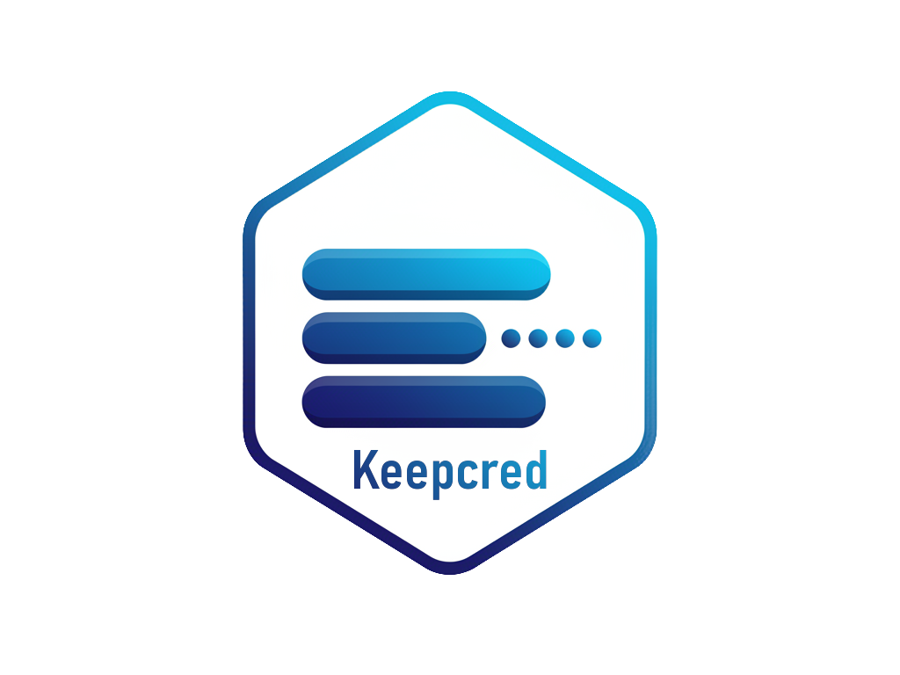

<div align="center">
  
  <h1>Keepcred</h1>
  <a href="https://github.com/keepcred/keepcred/blob/main/LICENSE"></a>
  <br />
  <br />
  <a href="#установка"><b>ℹ️ Описание</b></a>
  <span>&nbsp;&nbsp;•&nbsp;&nbsp;</span>
  <a href="#-безопасность"><b>🔒 Безопасность</b></a>
  <span>&nbsp;&nbsp;•&nbsp;&nbsp;</span>
  <a href="#установка"><b>🚀 Установка</b></a>
</div>

## ℹ️ Описание

**Keepcred** — это менеджер персональных данных.

## 🔒 Безопасность
**Keepcred** разработан на основе архитектуры **Zero-Knowledge**. Это означает, что данные шифруются на устройстве пользователя, и разработчик не имеет доступа к мастер-паролю или расшифрованным данным.

### 🛡️ Используемые алгоритмы
- **Шифрование данных:** `AES-256-GCM`
  - Используется для шифрования конфеденциальных данных _(пароли, логины, заметки)_;
  - Режим `GCM` дополнительно обеспечивает целостность данных;
- **Хэширование мастер-пароля:** `Scrypt`
  - Используется для верификации в приложении;
  - Устойчив к атакам на `GPU`/`ASIC` благодаря требованиям к памяти;
- **Формирование ключей:** `PBKDF2`
  - Используется для генерации ключа шифрования из **мастер-пароля**;
- **Генерация случайных чисел:** `CSPRNG`

### 🔑 Архитектура шифрования
Для защиты данных используется метод **Key Wrapping**:

1. **DEK:** При создании профиля генерируется случайный 256-битный ключ, которым шифруются все данные пользователя. **Данный ключ никогда не меняется.** Это позволяет менять мастер-пароль без перешифровки всей БД.
2. **KEK:** Из мастер-пароля пользователя генерируется ключ-обёртка.
3. **Хранение:** `DEK` хранится в БД в зашифрованном виде.
4. **Расшифровка:** При входе в приложение KEK восстанавливается из введенного пароля, расшифровывает DEK, и DEK загружается в оперативную память.

### 💽 Безопасность памяти
- Ключ шифрования (`DEK`) существует в расшифрованном виде **только в Main Process**, предварительно изолированном от процесса рендера;
- Ключ никогда не передается в Renderer Process (UI интерфейс), что защищает от XSS-атак;
- При блокировке хранилища или выходе из приложения память с ключом принудительно очищается;

## 🚀 Установка

1. Клонируйте код:

```sh
git clone https://github.com/keepcred/keepcred
```

2. Установите зависимости:

```sh
npm i
```

3. Создайте файл `.env` скопировав `.env.example`:

```sh
cp .env.example .env
```

✅ **Готово!**
